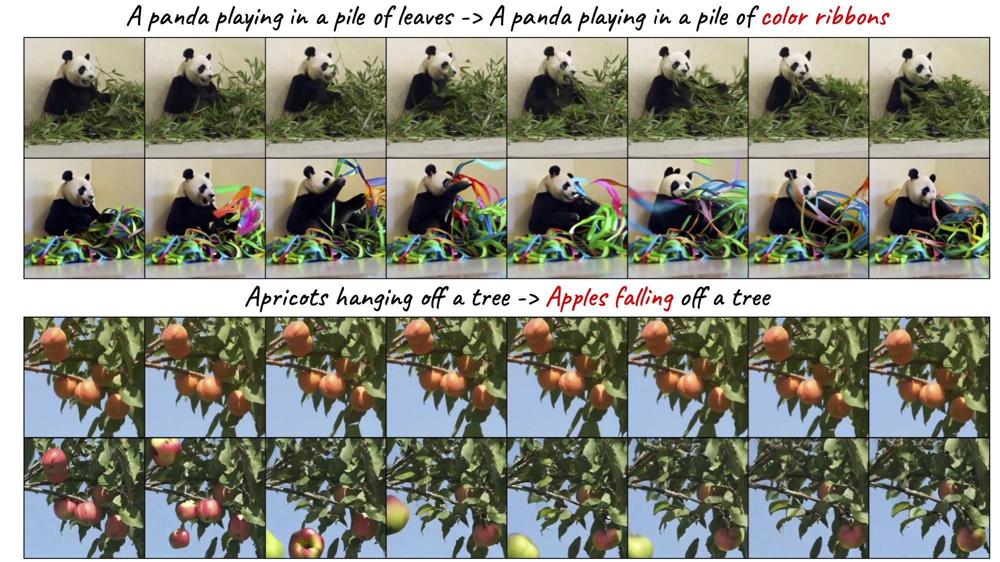

# MoCA: Motion-Conditioned Image Animation for Video Editing
Wilson Yan<sup>1,2</sup>, Andrew Brown<sup>1</sup>, Pieter Abbeel<sup>2</sup>, Rohit Girdhar<sup>1</sup>, Samaneh Azadi<sup>1</sup>

<sup>1</sup>GenAI, Meta, <sup>2</sup> UC Berkeley



## VideoEdit Benchmarking Data
To download the VideoEdit evaluation dataset in a local directory as ``` ${DIR} ```, run
```
sudo apt-get update && sudo apt-get install ffmpeg
pip install -r requirements.txt
bash dataset/download_process_all.sh ${DIR}
```

This dataset includes the motion editing examples we collected from [YouTube-8M](https://research.google.com/youtube8m/), as well as filtered examples (excluding human faces and hands due to legal concerns) from [Loveu-tgve-2023 data](https://github.com/showlab/loveu-tgve-2023) and the [Dreamix examples](https://dreamix-video-editing.github.io/). Please make sure to cite them accordingly. 

## License
VideoEdit data is released under CC-BY-NC 4.0 license. See [License](LICENSE) for additional details.


